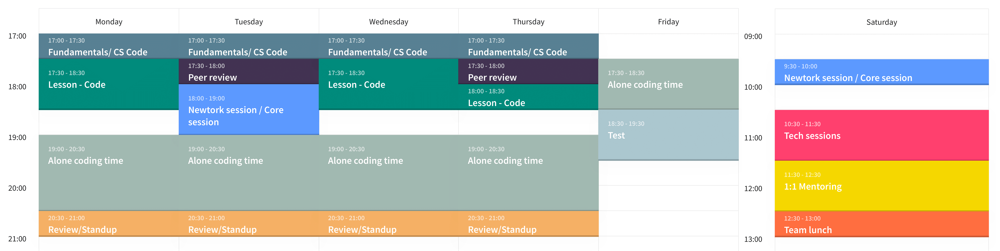

 

<h1 align="center">Schedule</h1>

This will be your schedule for the entire time. You could also find a Google Calendar with all the schedule sessions  <a href="https://calendar.google.com/calendar/u/1?cid=Y190aTllaXNuazExaGhsNXRrOHZvNHRkdGs3MEBncm91cC5jYWxlbmRhci5nb29nbGUuY29t">here 📅</a>.

------

------
 

## Fundamentals/CS Code Challange
> You will be solving different challenges related to the technology in which you will be working

## Lesson - Code
> You will be learning alongside with tech leads

## Alone coding time
> You will be applying the knowledge by building a project or coding 

## Review/Standup
> Teach leads will be resolving code challange questions, after that, you will be exposing what was worked on the alone coding time block

## Peer review
> You will come together in pairs and provide feedback to each other

## Network session / Core session
> You will be attending to different sessions about different technology themes

## Test
> You will be resolving tests about different skills

## Tech session
> You will have time to make a presentation on a topic of interest

## 1:1 Mentoring
> Together with the teach leads, you will be solving doubts about the work done during the week.

## Team lunch
> Time to have fun with friends